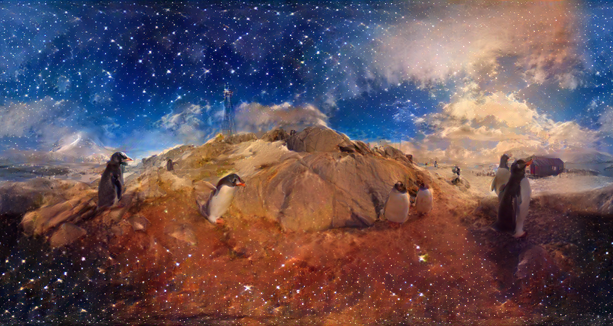

# Generative AI algoritmen & Artistic style transfer voor 360 graden beelden/video 

## Probleemstelling

De meeste algoritmen rondom beeldverwerking/rendering zijn 
ontwikkeld voor 2D beelden. Als we deze algoritmen toepassen zonder enige aanpassing op 360 graden beelden leidt dit tot artefacten. Dit komt omdat de rechterkant van de afbeelding moet overeenkomen met de linkerkant en deze algoritmen zijn hier niet op voorzien. Dit zorgt ervoor dat er een zeer duidelijke overgang te zien is tussen de beelden. 

In de literatuur zijn er enkele initiatieven voor dit probleem, al staan deze zeker en vast nog niet op punt.

Als we gaan kijken in het domein rondom computer visie kunnen we terecht om een betere oplossing te onderzoeken.

Het doel van het project is om deze bestaande oplossingen/algoritmen te inventariseren en te onderzoeken welke algoritmen het beste resultaat leveren door deze uit te voeren op de verzamelde data en uiteindelijk waar nodig aan te passen om een zo goed mogelijk eindresultaat te creëren.

## Data

De data zullen we verzamelen door de wijde wereld in te trekken en zelf
het beeldmateriaal waarop we onze algoritmen zullen loslaten te voorzien. Mits
behulp van het materiaal dat we nodig hebben om deze beelden vast te leggen,
die we hopelijk door school aangeboden krijgen.

## Verwachtingen en doelstellingen

De verwachtingen zijn om de bestaande algoritmen te bestuderen en onderzoeken welke algoritmen het beste presteren. Het einddoel is niet alleen te onderzoeken hoe de bestaande implementaties van de verschillende algoritmen presteren , maar ook zelf in de algoritmen te duiken om te kijken waar er nog 
optimalisatie mogelijk is, om zo een nog beter resultaat als in de literatuur te verkrijgen.
