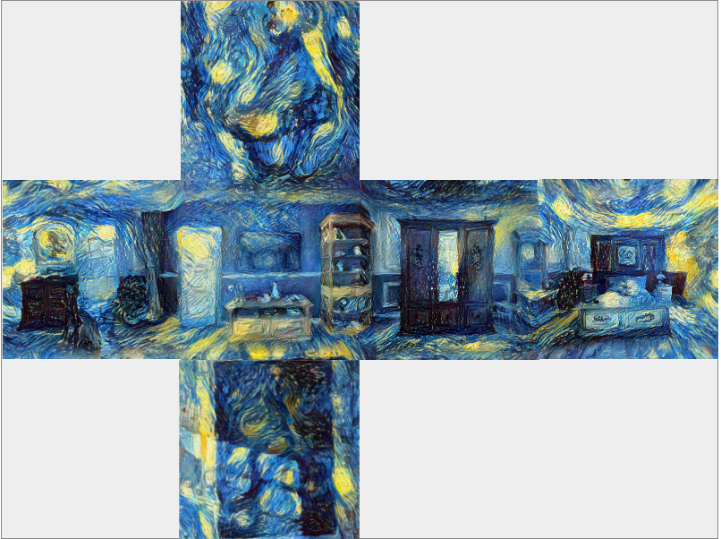
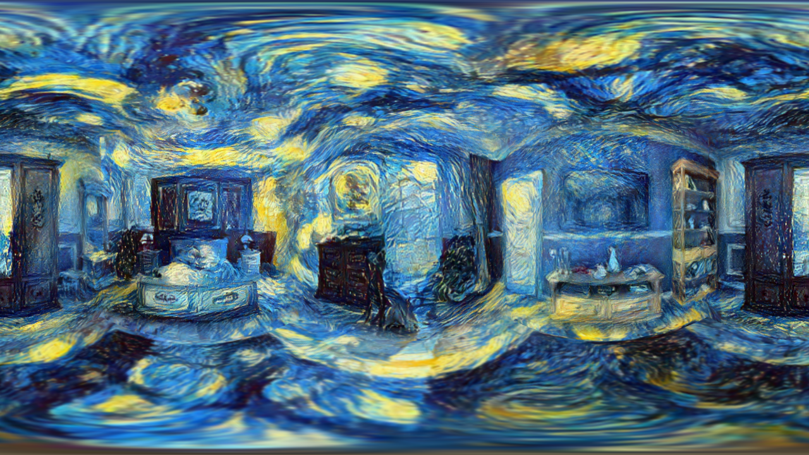

# Algemeen

 

Door gebruik te maken van [Neural Style Transfer](https://doi.org/10.48550/arXiv.1508.06576) adhv een bestaand [repo](https://github.com/crowsonkb/style-transfer-pytorch)
op een afstandegetrouwe cilinderprojectie zien we dat er op de resulterende afbeelding (in 360° beeld) een duidelijke scheiding is.

 

Dit wordt veroorzaakt doordat het algorithme geen rekening houd met het feit dat de linker- en rechterzijde moeten worden samengebracht in 360° beeld. Daarbij is er op het
standpunt van de observeerder (centrum van 360° afbeelding) een vervorming die het doet lijken of alles aanzichten convergeren naar één punt.

## Kubus map

Een mogelijke oplossing hiervoor kan een kubus map zijn waarbij de afstandsgetrouwe projectie wordt uitgevouwen naar de 6 vlakken van een kubus. 
Hierna wordt de style transfer toegepast op elk vlak. 

*afstandsgetrouwe cilinderprojectie --> kubus map (https://jaxry.github.io/panorama-to-cubemap/)

*kubus map --> afstandsgetrouwe cilinderprojectie (https://danilw.github.io/GLSL-howto/cubemap_to_panorama_js/cubemap_to_panorama.html)

### Resultaat

### Nieuwe artefacten

Deze uitvoering zorgt ervoor dat de convergerende lijnen in het centrum verdwijnen maar hierdoor duiken er nieuwe artefacten op bij de samenvoeging van de kubus vlakken.
Deze lijnen geven de indruk dat de observeerder zich in een kubus bevind.

### Blending

Door een afstandsgetrouwe cilinderprojectie met overlappende uiteinden te gebruiken voor style transfer kunnen we de stitch-lijn proberen wegwerken.
Deze afbeeldingen wordt met overlap gestyled en daarna worden de overlappende uiteinden over elkaar geblend.

## Blended Cube Map

Door simpele blending toe te passen op overlappende kubus-gezichten kunnen we de bestaande artefacten minimaliseren en de convergentie afhouden.

Resultaat:

###Cube map uitbreiden

Met enkele gezichten te repliceren kunnen we dit process versnellen en het blenden minder tijdrovend maken.

Resultaat:

