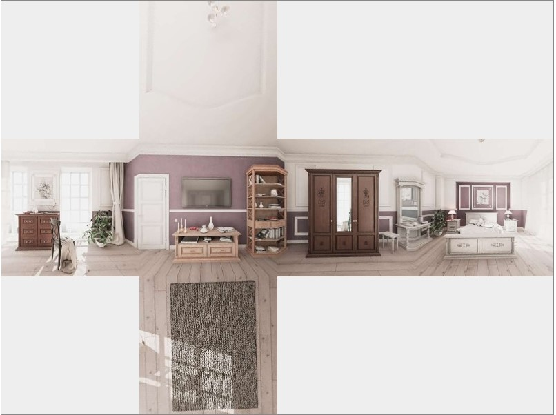
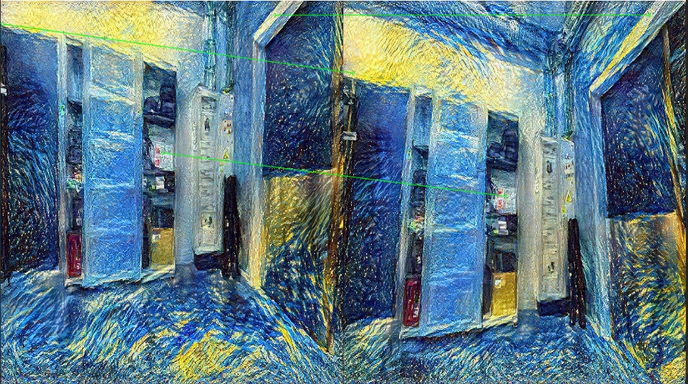

# Algemeen

 

Door gebruik te maken van [Neural Style Transfer](https://doi.org/10.48550/arXiv.1508.06576) adhv een bestaand [repo](https://github.com/crowsonkb/style-transfer-pytorch)
op een afstandegetrouwe cilinderprojectie zien we dat er op de resulterende afbeelding (in 360° beeld) een duidelijke scheiding is.

 

Dit wordt veroorzaakt doordat het algorithme geen rekening houd met het feit dat de linker- en rechterzijde moeten worden samengebracht in 360° beeld. Daarbij is er op het
standpunt van de observeerder (centrum van 360° afbeelding) een vervorming die het doet lijken of alles aanzichten convergeren naar één punt.

## Kubus map

Een mogelijke oplossing hiervoor kan een kubus map zijn waarbij de afstandsgetrouwe projectie wordt uitgevouwen naar de 6 vlakken van een kubus. 
Hierna wordt de style transfer toegepast op elk vlak. 

*afstandsgetrouwe cilinderprojectie --> kubus map (https://jaxry.github.io/panorama-to-cubemap/)

*kubus map --> afstandsgetrouwe cilinderprojectie (https://danilw.github.io/GLSL-howto/cubemap_to_panorama_js/cubemap_to_panorama.html)

### Resultaat

### Nieuwe artefacten

Deze uitvoering zorgt ervoor dat de convergerende lijnen in het centrum verdwijnen maar hierdoor duiken er nieuwe artefacten op bij de samenvoeging van de kubus vlakken.
Deze lijnen geven de indruk dat de observeerder zich in een kubus bevind.

## SIFT 

Door gebruik te maken van SIFT om kenmerkende eigenschappen uit gelijkaardige afbeeldingen te halen kunnen we afbeeldingen samenvoegen zonder een lijn te genereren.
Een simpele toepassing van deze techniek op een rectilineaire afbleedingenspaar geeft als resultaat zeer veel correcte kenmerkende eigenschappen (correct duidt hier op
dezelfde plek op beide afbeeldingen).

Maar na een style transfer toe te passen op rectilineaire afbeeldingen zien we dat de kenmerkende eigenschappen zo goed als verdwijnen. 
Dit heeft als gevolg dat het samenvoegen van de afbeeldingen niet correct verloopt.

### SIFT advanced

In plaats van kenmerkende eigenschappen te zoeken op een afbeelding die getransformeerd is met de style transfer nemen we de eigenschappen van de originele afbeeldingen om een mask te maken en de afbeeldingen te blenden. Hiervoor maken we gebruik van een bestaand [repo](https://github.com/lukasalexanderweber/stitching) met enkele kleine aanpassingen. 

Door een afstandsgetrouwe cilinderprojectie met uitbreiding aan de zijkant (om overlap te generen) te nemen en deze te splitsen in het midden en de zijkanten
terug aan elkaar te stitchen kunnen we het lijn artefact van hierboven proberen wegwerken.

1. Originele afbeelding met uitbreiding (overlap)

2. Originele afbeelding gesplit
 
4. Style transfer afbeeldingen 
 
5. Resultaat

#### Sift met rectilineaire afbeeldingen

Voor onderstaande afbeelding zijn er 16 rectilineaire afbeeldingen gebruikt als een test van deze blending/stitching methode op meerdere afbeedlingen vanuit
verschillende hoeken.

de volgende stap is nu deze methode toepassen op genoeg afbeeldingen om een volledig 360° afbeeldingen te vormen en te evalueren.

