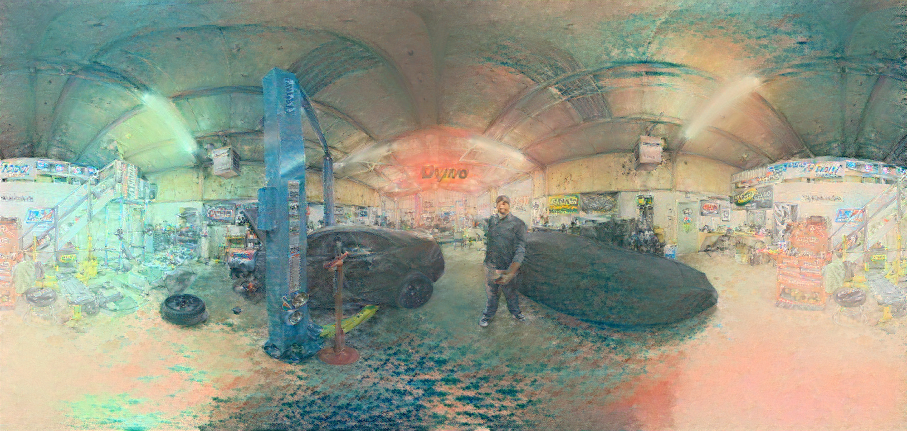

# Algemeen

 

Door gebruik te maken van [Neural Style Transfer](https://doi.org/10.48550/arXiv.1508.06576) adhv een bestaand [repo](https://github.com/crowsonkb/style-transfer-pytorch)
op een afstandegetrouwe cilinderprojectie zien we dat er op de resulterende afbeelding (in 360° beeld) een duidelijke scheiding is.

 

Dit wordt veroorzaakt doordat het algorithme geen rekening houd met het feit dat de linker- en rechterzijde moeten worden samengebracht in 360° beeld. Daarbij is er op het
standpunt van de observeerder (centrum van 360° afbeelding) een vervorming die het doet lijken of alles aanzichten convergeren naar één punt.

### Blending

Door een afstandsgetrouwe cilinderprojectie met overlappende uiteinden te gebruiken voor style transfer kunnen we de stitch-lijn proberen wegwerken.
Deze afbeeldingen wordt met overlap gestyled en daarna worden de overlappende uiteinden over elkaar geblend.

