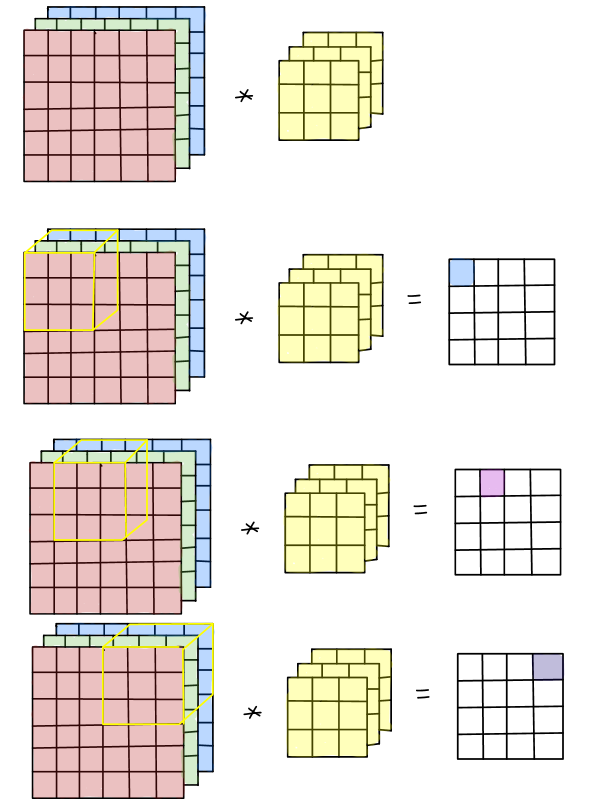
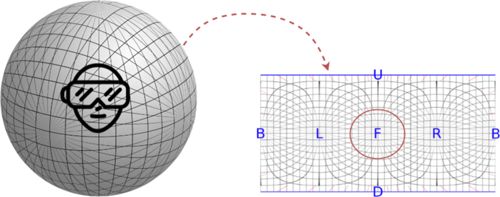

# Kernel (image processing)

**A kernel** is een matrix die als mask of filter gebruikt wordt bij convolutie.

# Afstandsgetrouwe cilinderprojectie (Equirectangular projection)

**Afstandsgetrouwe cilinderprojectie (Equirectangular projection)** is het omvormen van een spherische afbeelding (360 graden)
door de schuinstand en verdraaing (yaw & pitch) te mappen naar een platte rechthoekige afbeelding (2D). Dit zorgt voor vervorming in de afbeelding.

