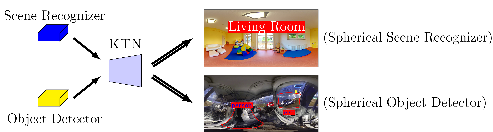

# Kernel Transformer Networks

{: .warning }
> This code repo has deprecated code and is very hard to implement!

[Github Repo](https://github.com/sammy-su/KernelTransformerNetwork){: .btn .fs-5 .mb-4 .mb-md-0 }

Deze technologie wordt gebruikt in Spherical Convultion (Su & Grauman). Een kernel die geplaatst kan worden op bestaande CNN's om deze
te kunnen gebruiken voor spherische afbeeldingen.

Jammer genoeg wordt in deze paper het "boundary problem" niet aangepakt.

