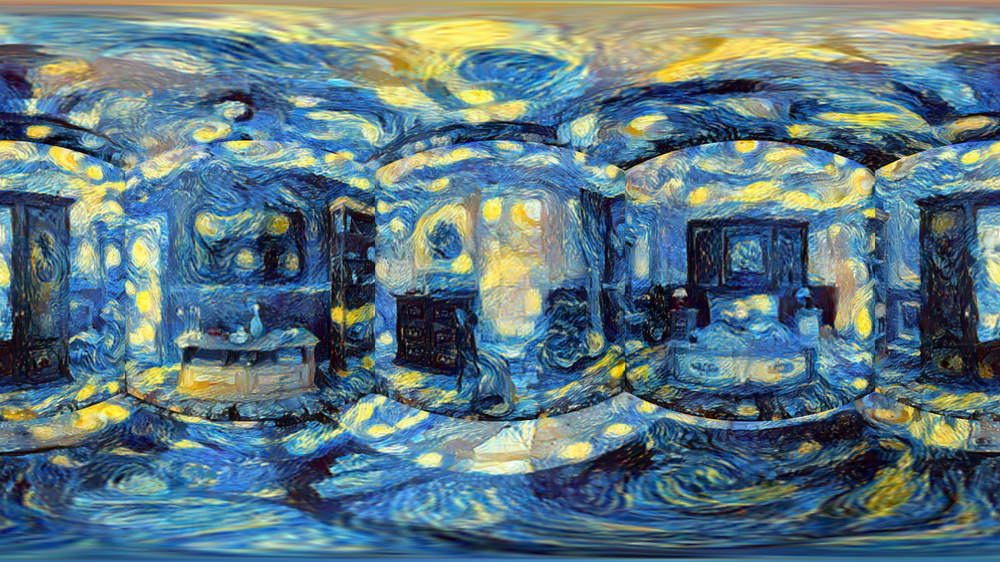
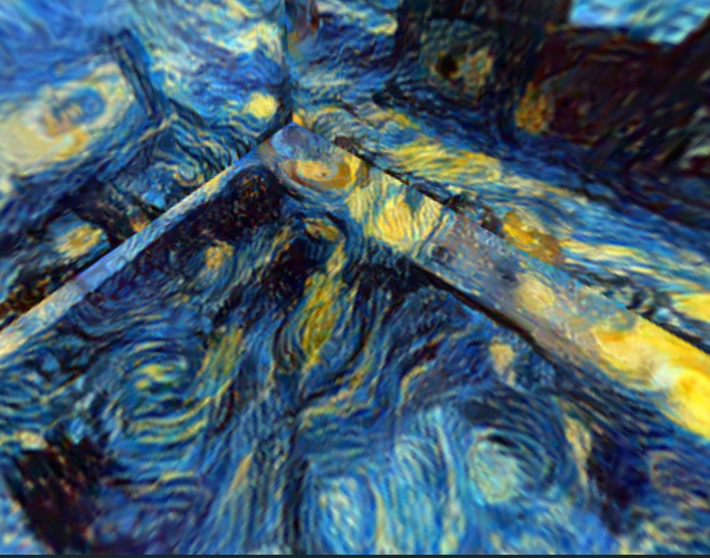
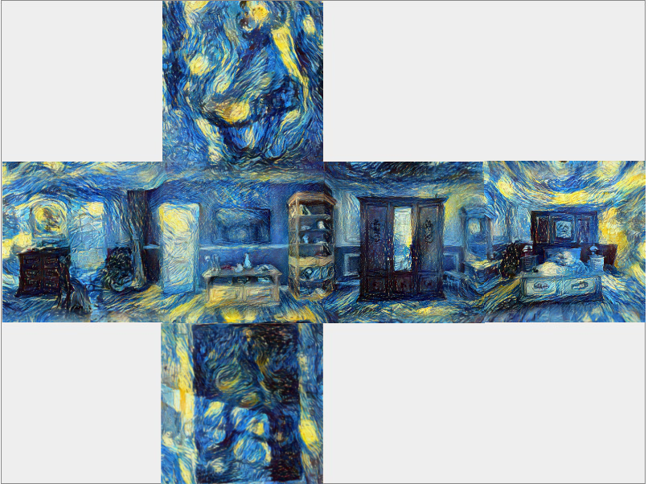
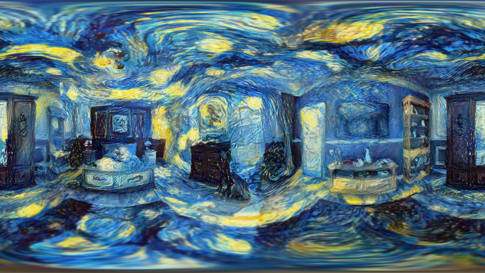

## Kubus map

Een mogelijke oplossing hiervoor kan een kubus map zijn waarbij de afstandsgetrouwe projectie wordt uitgevouwen naar de 6 vlakken van een kubus. 
Hierna wordt de style transfer toegepast op elk vlak. 

*afstandsgetrouwe cilinderprojectie --> kubus map (https://jaxry.github.io/panorama-to-cubemap/)

*kubus map --> afstandsgetrouwe cilinderprojectie (https://danilw.github.io/GLSL-howto/cubemap_to_panorama_js/cubemap_to_panorama.html)

### Resultaat

### Nieuwe artefacten

Deze uitvoering zorgt ervoor dat de convergerende lijnen in het centrum verdwijnen maar hierdoor duiken er nieuwe artefacten op bij de samenvoeging van de kubus vlakken.
Deze lijnen geven de indruk dat de observeerder zich in een kubus bevind.

## Blended Cube Map

Door simpele blending toe te passen op overlappende kubus-gezichten kunnen we de bestaande artefacten minimaliseren en de convergentie afhouden.

Resultaat:

### Cube map uitbreiden

Met enkele gezichten te repliceren kunnen we dit process versnellen en het blenden minder tijdrovend maken.

Resultaat:

